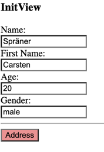
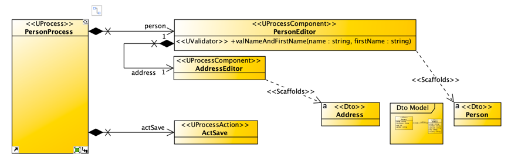
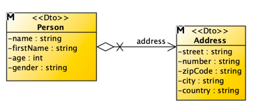

# WARNING! Highly under construction

__The projects in this dirctory are highly under 
cunstructions. The purpose of the projects is
to test the implementation of upe-code, upe-rest,
upe-angular-frontend and the cgV19-Cartridge for 
upe.__

But of course you can look around and get an idea
of how thinks are ment to be used. But please _do 
not blame me for code in this directory_.

## The projects are:

### upe-application-catridge
A [cgV19-cartridge](https://github.com/carstenSpraener/cgV19) for model driven development with
upe.

### upe-application
A model driven developed application to demonstrate
the use of upe. The model is a VisualParadigm 
UML-Model.

The application runs as a Spring Boot application 
without a frontend.

### upe-ngclient
A prototype/POC for a Angular fronend for an
upe application. Not very nice but with some 
interesting features.



## Features

* The process layer is developed model driven (or low code like). It's 
model is a VisualParadigm UML-Model containg mainly these classes:

__Process Layer of the demo application__
 

__DTO-Layer of the demo application__



* All business logic is running on the server. The
fronend has  just code to splitt the fields into
views and bind some input fields and buttons to
process elements.

```hmtl
<div [upeProcess]="'personProcess'" style="margin-bottom: 60px">
<div [upeView]="'init'" class="upePanel">
    <h3>InitView</h3>

    <label>Name:</label>
    <input [upeField]="'/person/name'"/>
    <button [upeViewNav]="'address'">Address</button>
 </div>

```
* validation errors will be displayed immediately. Also enable/diable elements or
visible/hide process elements.

* Forward and Backword-Button in the browser are 
allowed. You can go back through your inputs and
errors will reappear.

* The link in the browser can be shared. Opening the
link will open the application in exact the same state
as you see it.

