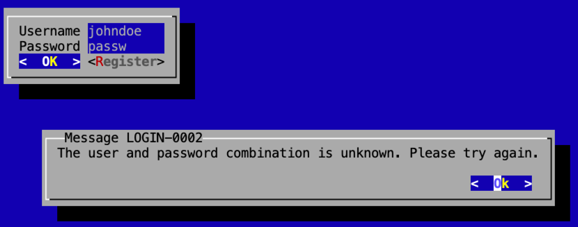

# Create a UI for the application

Until now, we have a complete application that can verify user
logins, register new users and delegate to a main process after
successful login. But even so that it is complete, tested and could run we
can't see anything. In the next steps let's change this with a tiny little 
frontend. 

In this step a very simple text base UI Lanterna is used to demonstrate the
binding of a UPE application to a real usable frontend. Lanterna is quite easy
to use, has a small dependency graph and don't need many resources. 



In the step7 we will create a vaadin application and step 8 will bring us to
an angular frontend with a spring boot backend. All these with no adjustments to
the sample application. The application just use different ProcessEngines 
and bindings.

### What you will learn in this step

* Making a stand-alone application
* Creating a new ProcessEngine to run a Lanterna application
* binding process fields to Lanterna TetBox and Buttons
* Creating panels for processes.

## Making a stand-alone application

In this step the application will be a stand-alone application running on 
a users machine. So there has to be some Main-Class and this class needs to
define which processes belongs to the application and which environment should 
be used.

For this Lanterna example it is implemented in this java class:
[LanternaApplication.java](src/main/java/upe/sample/lanterna/LanternaApplication.java)

Let's look at the details:
```java
@UpeApplication({
        LoginProcess.class,
        HelloWorldProcess.class,
        UserRegistrationProcess.class
})
public class LanternaApplication {

```
